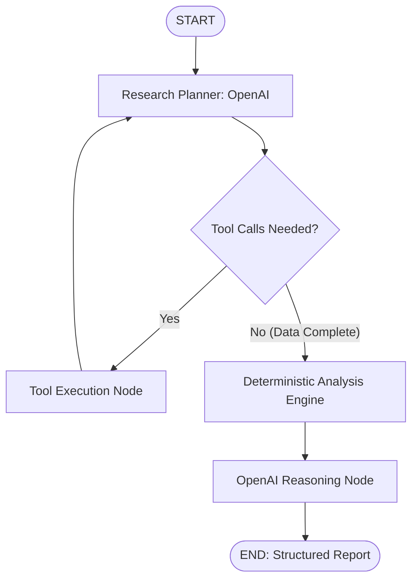

# 📈 PSX-AI-Research-Agent: Institutional AI Stock Research for PSX

**PSX-AI-Research-Agent (PSXenius)** is an institutional-grade, evidence-grounded AI investment research agent designed specifically for the **Pakistan Stock Exchange (PSX)**. 

Built with **LangGraph**, **OpenAI (`gpt-4o-mini`)**, **`pypsx-toolkit`**, and **`psx-mcp-server`**, the agent autonomously plans research tasks, fetches exchange data dynamically, deterministically computes key technical and fundamental indicators in-memory without duplicate fetches, and produces audit-traceable investment reasoning.

---

## 🌟 Key Features

- **Autonomous Research Planning**: Uses OpenAI function calling to selectively execute only the required tools (quotes, multi-year OHLCV history, financial statements, or cash dividend history) based on the user's research query.
- **Deterministic Python Analytics Engine**:
  - **Technical Indicators**: 50-day & 200-day Simple Moving Averages (SMA), 14-day RSI (Wilder's smoothing), MACD (12, 26, 9), distance from 52-week high & low.
  - **Performance & Risk**: Calendar date-based 1-Year & 3-Year returns (recording exact observation dates without silent fallbacks), 5-Year Price CAGR, Annualized Volatility, and Maximum Drawdown.
  - **Dividend Analytics**: Trailing Twelve Months (TTM) cash dividend yield, 3-Year Dividend CAGR, and annual dividend history (2021–2026 YTD).
  - **Statement Validation**: Cross-checks income statement net profit margins against reported ratios.
- **Zero Redundant Data Downloads**: The deterministic analysis engine consumes raw data already collected by tool calls inside `AgentState`, completely eliminating redundant network calls.
- **1-to-1 Evidence Traceability**: Every metric cited in the reasoning output is tied to an explicit, verified `EvidenceItem` (`EVD-FUND-*`, `EVD-TECH-*`, `EVD-DIV-*`) stating its calculation origin, date, and value.
- **Strict Semantic Guardrails**:
  - Distinguishes historical annual figures from partial `2026 (YTD)` figures and suppresses invalid YoY comparisons on partial years.
  - Contextualizes negative PEG ratios as reflections of negative earnings growth rather than conventional undervaluation.
  - Enforces objective analytical interpretation without hallucinating financial figures or issuing unsupported future return guarantees.

---

## 🏗️ Architecture & Workflow



---

## 📁 Repository Structure

```
PSX-AI-Research-Agent/
├── src/                              # Core Application Code
│   ├── agent/                        # LangGraph State, Nodes, and Workflow
│   │   ├── __init__.py
│   │   ├── graph.py                  # Full research StateGraph definition
│   │   ├── models.py                 # Pydantic StructuredReasoningOutput model
│   │   ├── nodes.py                  # Planner, tool execution, analysis engine, & reasoning nodes
│   │   ├── state.py                  # AgentState & EvidenceItem TypedDict definitions
│   │   └── tools_registry.py         # Unified registry of MCP and toolkit tools
│   │
│   ├── analysis/                     # Deterministic Calculation & Validation Modules
│   │   ├── __init__.py
│   │   ├── technical.py              # SMA 50/200, RSI 14, MACD, 52W high/low
│   │   ├── performance.py            # Date-based 1Y/3Y returns, 5Y CAGR, Max Drawdown, Volatility
│   │   ├── dividends.py              # TTM yield, 3Y dividend CAGR, historical yields (2021-2026 YTD)
│   │   ├── validation.py             # Statement vs ratio cross-validation
│   │   ├── engine.py                 # Source metrics extraction orchestrator
│   │   └── models.py                 # DerivedMetric container dataclasses
│   │
│   └── tools/                        # Data Layer Integration
│       ├── __init__.py
│       ├── mcp_client.py             # MultiServerMCPClient connection manager
│       ├── mcp_tools.py              # psx-mcp-server tool wrappers
│       └── toolkit_tools.py          # pypsx-toolkit wrappers
│
├── .env.example                      # Template for required environment variables
├── .gitignore                        # Git ignore rules (protects .env and caches)
├── main.py                           # CLI Application Entry Point
├── pyproject.toml                    # Dependencies and package metadata
├── uv.lock                           # Reproducible lockfile
└── README.md                         # Project Overview
```

---

## ⚡ Quick Start

### 1. Prerequisites

- Python 3.11+
- [uv](https://docs.astral.sh/uv/) (Recommended package and virtual environment manager)
- An OpenAI API Key

### 2. Installation

Clone the repository and install all dependencies:

```bash
git clone https://github.com/AbdulSamad200/PSX-AI-Research-Agent.git
cd PSX-AI-Research-Agent
uv sync
```

### 3. Environment Configuration

Create your `.env` file from the provided template:

```bash
cp .env.example .env
```

Edit `.env`:

```env
OPENAI_API_KEY=sk-proj-yourActualOpenAIApiKey
OPENAI_MODEL=gpt-4o-mini
```

---

## 🖥️ Running the Agent (CLI)

Run research analysis for any PSX company using `main.py`:

```bash
# Analyze default stock (MEBL)
uv run python main.py

# Analyze a specific PSX ticker
uv run python main.py FFC
uv run python main.py HUBC
uv run python main.py BAFL

# Custom research query
uv run python main.py MEBL --query "Analyze MEBL for a long-term dividend-growth investment over 3–5 years."
```

### Sample Output

```text
================================================================================
 🚀 PSXenius Agent Unified Graph Execution for: [MEBL]
 Query: Analyze MEBL for a long-term dividend-growth investment over 3–5 years.
================================================================================

📌 Executing Unified LangGraph Workflow (Planning -> Tools -> Engine -> Reasoning)...

✓ Executed Tools: ['toolkit_get_stock_ohlcv', 'toolkit_get_company_fundamentals', 'toolkit_get_dividend_history']
✓ Technical Metrics Calculated:
   • SMA 50: 559.32 | SMA 200: 491.43
   • RSI 14: 66.13 | 1Y Return: 44.83% | 3Y Return: 388.98%
   • TTM Dividend Yield: 6.45% | 3Y Dividend CAGR: 14.47%

================================================================================
 🤖 OPENAI STRUCTURED REASONING REPORT: [MEBL]
================================================================================

💡 Investment View: Strong Earnings Momentum and Attractive Dividend Yield
🎯 Confidence Score: 0.85 / 1.00
🔗 Referenced Evidence IDs: ['EVD-FUND-MEBL-NPM', 'EVD-FUND-MEBL-EPSG', 'EVD-TECH-MEBL-RET1Y', 'EVD-DIV-MEBL-TTMYIELD', ...]

📊 Fundamental Interpretation:
   Meezan Bank Limited has demonstrated a robust Net Profit Margin at 21.18% (EVD-FUND-MEBL-NPM)...

📈 Technical Interpretation:
   The stock shows a positive technical outlook with 50-day SMA of 559.32 PKR above the 200-day SMA of 491.43 PKR...

💰 Dividend Interpretation:
   The TTM dividend yield is 6.45% (EVD-DIV-MEBL-TTMYIELD). The 3-year Dividend CAGR is 14.47% (EVD-DIV-MEBL-CAGR3Y)...
```

---

## ⚖️ License

MIT License. Designed for academic, educational, and analytical research purposes on the Pakistan Stock Exchange.
